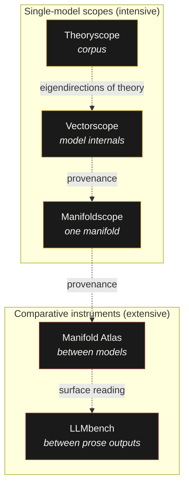

# Vector Lab

A suite of vector methods for vector theory.

**🌐 Website and map: [vector-lab-tools.github.io](https://vector-lab-tools.github.io)**

Vector Lab is a family of tools that make the internal geometry of large
language models, the comparative structure of embedding spaces, and the
topography of theoretical corpora legible as objects of empirical and
critical analysis. The instruments share a design language (Next.js frontend,
FastAPI / PyTorch backend where needed, editorial interface) and a
commitment: geometry is not neutral, and the critical humanities need
instruments of their own.

## The family

### Comparative instruments

Extensive instruments that compare across models. Currently the most
mature; the single-model scopes are in early alpha.

- **[Manifold Atlas](https://github.com/vector-lab-tools/manifold-atlas)** — between
  models at their output embeddings. Concept distance, negation gauge,
  hegemony compass, silence detector, agonism test, and more.
- **[LLMbench](https://github.com/vector-lab-tools/LLMbench)** — between models at
  the level of generated prose. Dual-panel close reading, annotation,
  logprobs, probability visualisation.

### Single-model scopes (alpha)

Intensive instruments that open up a single object for inspection.

- **[Vectorscope](https://github.com/vector-lab-tools/vectorscope)** — inside a
  single open-weight model. Layer-by-layer weights, hidden states, attention,
  precision regimes.
- **[Manifoldscope](https://github.com/vector-lab-tools/manifoldscope)** — a single
  manifold as geometric and ideological object. Measure and critique bound
  together: intrinsic dimension, curvature, density, and the politics of
  what a geometry sediments or refuses.
- **[Theoryscope](https://github.com/vector-lab-tools/theoryscope)** — a corpus of
  theoretical texts as navigable geometry. Renormalisation-group flow,
  eigendirections, fixed points, universality classes.

## Map

## Further reading

The tools operationalise claims developed in the vector theory sequence on
Stunlaw and the wider research programme. The essays are the conceptual
statements; the tools are the empirical instruments.

**Vector theory sequence (Stunlaw):** *The Vector Medium*, *Vector
Theory*, *What Is Vector Space?*, *What Is the Manifold?*, *Generation
Vector*, *What Is Theory Space?*, *Renormalising Theory*.

**Books and longer work:** *Critical Theory and the Digital* (Bloomsbury,
2014); *AI Critical Theory*, in progress; *Synthetic Media and
Computational Capitalism*, AI & SOCIETY (2025).

**Centre for Vector Media:** the Leverhulme bid develops the institutional
and methodological frame within which Vector Lab operates.

For an annotated reading guide and per-tool deep dives see
[vector-lab-tools.github.io](https://vector-lab-tools.github.io).

---

*Vector Lab is directed by [David M. Berry](https://github.com/dmberry).
Tools are research instruments and are offered as-is under permissive
licences. See each repository for details.*
